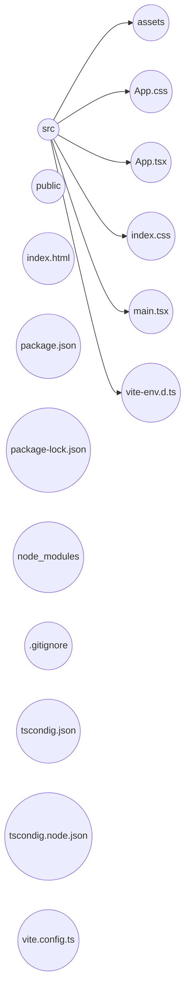

### Concepts

### Why was created

When a web page is load into the browser (html). The browser gets the HTML code and converts it to a tree structure called Document Object Model (DOM).
React use **components** to create and update DOM. 
A React Application is a tree composed of component with a App component as root.

* [[JSX]]
### Create a React App

**Create React APP - (CRA)**

* ...

**Vite***

* npm create vite@latest

### React project structure




### Create new component

* create new file called `Message.tsx`

```jsx
function Message() {
	return <h1>Hello World</h1>;
}

export default Message;

// usage:
// App.tsx
import Message from './Message';

function App() {
	return <div><Message /></div>
}

export default App;
```

### Check the javascript final code:
* `babeljs.io`
### Interpolation

Inside the interpolation symbol `{}` it's possible to add any piece of code that returns a value.

```jsx
function Message() {
	const name = 'Mosh';
	if (name)
		return <h1>Hello {name}</h1>;
	return <h1>Hello World</h1>
}
```

### How React Works

![[Pasted image 20231107170101.png]]

React will renders the Virtual DOM with changes in h1 element. Then will compare with actual DOM and then will change only the h1 element in DOM.
**Note**: Technically, the DOM is manipulated by `react-dom`. You can check in the `package.json` file.

Inside `index.html` it's possible to see a reference to `main.tsx` file. There, `ReactDOM.createRoot()` will renders a `React.StrictModel` inside a `root` element.

### JSX tag particularities

```jsx
function ListGroup() {
	return (
	<ul className="list-group">
	<li className="list-group-item">An Item</li>
	</ul>
	);
}

export default ListGroup;
```

* It's necessary use the `className` name instead of just `class`.
* The `()` is necessary to have the JSX being created as multi-line.

### Fragments

A component cannot return more than one element. React will try to do something like that when rendering a element: `React.createElement('h1')`.

To resolve that is possible to use a `<div>` tag surround all the component or use a `Fragment`.

```jsx
import { Fragment } fom 'react';

<Fragment>
...
</Fragment>
```

Another way to do that:

```jsx
<>
...
</>
```

### Rendering Lists

```jsx
const items = [...];

return (
	<>
		<ul className="">
			{items.map((item) => {
				<li key={item.id}>{item}</li>
			})}
		</ul>
	</>
)
```

### Conditional Rendering

```jsx
const items = [...];

const message = items.length === 0 ? <p>No item found</p> : null;
const message = items.length === 0 && <p>No item found</p>;
			
return (
	<>
		{message}
		<ul className="">
			{items.map((item) => {
				<li key={item.id}>{item}</li>
			})}
		</ul>
	</>
)
```

### Handling Events

```typescript
<li onClick={(event: MouseEvent) => console.log(event)} >item</li>
```

### Passing data via Props

```typescript
// { items: [], heading: string }
interface Props {
	item: string[];
	heading: string;
}

function Component({items, heading}: Props) {

}

...
// çare t component
<ParentComponent items={[]} heading="title" />
```

### Passing functions via Props

```typescript
interface Props {
	onSelectItem(): (item: string) => void;
}

function Component({onSelectItem}: Props) {

}

...
<li onClick={() => onSelectItem(item)} />

...
//parent component
<ParentComponent onSelectItem={handleSelectItem} />
```

### Passing Children

```typescript
interface Props {
	children: ReactNode;
}

const Alert = ({ children }: Props) => {
	return (
		<div className="">{children}</div>
	)
}

<Alert>Text</Alert>
```

### Forms

* [[React - Forms]]
## Routing

* [[React - Routing]]
### Hooks

* [[React Hooks]]

### Redux

* [[Redux]]
### Tools

* [[React Dev Tools]]

#frontend #reactjs
 