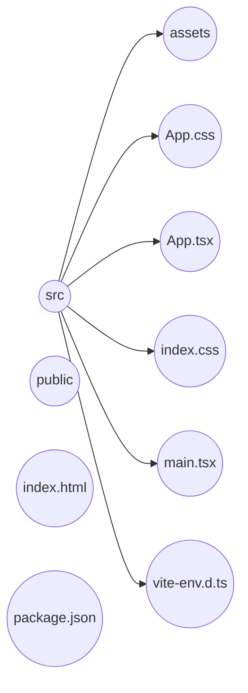

* The extension for Markdown is .md.
* Markdown is a way to format text.
* Can be rendered in HTML or PDF.
* To break link you can use a break line or two spaces in markup code.
* For header it's possible to use the # symbol from 1 to 6. Like:
# Example.

* For bold text it's possible to apply two **wildcards**.
* For italic it's just one *wildcard*.
* For cross off it's possible to use double ~ like: ~~cross off~~.
- To highlight a text it's possible to use doble equal symbol ==highlight== or HTML tag mark like <mark>highlight</mark>.
- to subscript a text it's possible to use the circumflex symbol ^subscript^ or Using HTML like  2 
- To create emotional is possible to use semicolon like :smile: or copy and paste 😁.
- To create a table, it's possible to use a syntax with pipes (|) and content like following:
	
| header_column1 | header_column2 | header_column3 |
|---|---|---|
| value1 | value2 | value3 |
| value4 | value5 ||

* Create flowcharts, mind maps:

You can create graph TD, graph LR... This will change the layout of the chart.

#markdown #markup

